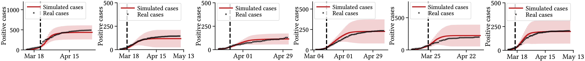
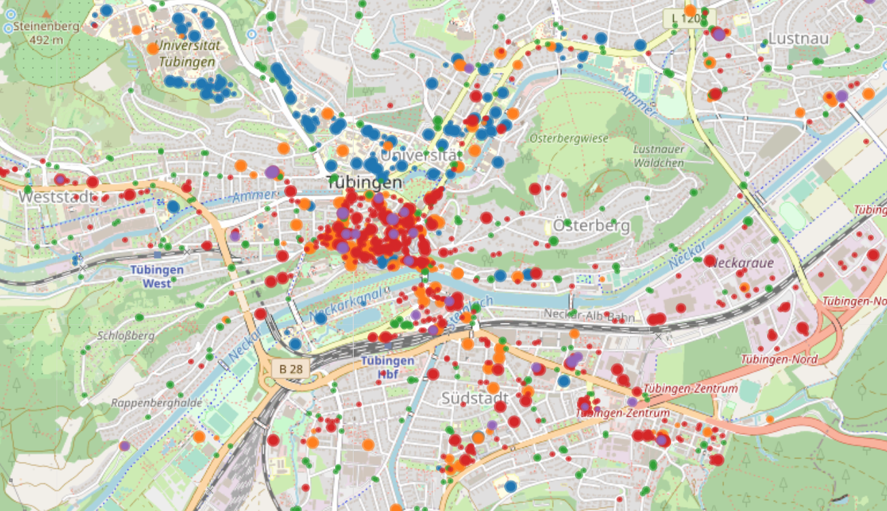

# Quantifying the Effects of Contact Tracing, Testing, and Containment Measures in the Presence of Infection Hotspots

This repository contains the code base to run the sampling algorithm of a high-resolution spatiotemporal epidemic model at large scale, which can be used to predict and analyze the spread of epidemics such as COVID-19 in any real-world city and region. Different testing & tracing strategies, social distancing measures and business restrictions can be employed, amended, and extended arbitrarily in a modular fashion. Details about the relevant theory and methods can be found in our [paper](https://arxiv.org/abs/2004.07641).

For the code used to generate the experimental results complementing the [PanCast](https://arxiv.org/abs/2011.08069) white paper refer to this [branch](https://github.com/covid19-model/simulator/tree/beacon).

## Project description

Motivated by several lines of evidence suggesting for *superspreading events* or infection hotspots to play a key role in the transmission dynamics of COVID-19, we introduce an epidemiological modeling framework that explicitly represents sites where infections occur or hotspots may emerge. We use temporal point processes to represent the state of each individual over time with respect to their mobility patterns, health, and testing status. The model leverages the locations of real-world sites and high-resolution population density data in a heuristic mobility model of a given region, which can be arbitrarily generalized.

Bayesian optimization is used to estimate mobility-related exposure parameters by fitting the model to  true observed case counts in a considered area. In our work on COVID-19, we study six regions in Germany and Switzerland, whose models were fit to real case counts over two-month windows before and during the "lockdown" in spring 2020:

<p align="center">

</p>


Using the estimated parameters of the region-specific models, the sampling algorithm allows for analyses of counterfactual scenarios under various local circumstances, e.g. in urban and rural as well as lightly and severely affected areas. 

Amongst several other things, this framework allows to study the effects of:  the effective reproduction number e.g. during a shorter "lockdown" (top left), overdispersion in the number of secondary infections per individual (top middle), compliance with contact tracing (top right), and narrowcasting of the empirical exposure probability to sites (bottom); here: first two for Bern (CH) and second two for Tübingen (GER).


<p align="center">


</p>


<p align="center">

</p>

## Organization

The `sim/` directory contains the entire project code, where all simulator-specific code is situated inside `sim/lib/`. The simulator operates using the following main modules and rough purpose descriptions:

| `sim/lib/`                                                   | Description                                                  |
| ------------------------------------------------------------ | ------------------------------------------------------------ |
| [dynamics.py](sim/lib/dynamics.py)                           | Simulator core; defines a **DiseaseModel** object for simulating the spread of the epidemic. |
| [measures.py](sim/lib/measures.py)                           | Containement measures; defines a **Measure** object for implementing intervention policies. |
| [mobilitysim.py](sim/lib/mobilitysim.py)                     | Mobility patterns; defines a **MobilitySimulator** object for mobility traces of individuals. |
| [distributions.py](sim/lib/distributions.py)                 | Epidemiology; contains COVID-19 constants and distribution sampling functions. |
| [calibrationFunctions.py](sim/lib/calibrationFunctions.py); [calibrationParser.py](sim/lib/calibrationParser.py); [calibrationSettings.py](sim/lib/calibrationSettings.py) | Parameter Estimation; defines **Bayesian Optimization pipeline** for estimating region-specific exposure parameters |
| [experiment.py](sim/lib/experiment.py)                       | Analysis; defines an **Experiment** object for structured analysis and plotting of scenarios |
| [plot.py](sim/lib/plot.py)                                   | Plotting; defines a **Plotter** object for generating plots. |

The `sim/` directory itself containts several scripts of the form `sim-*.py`, which run experiments and simulations as reported in our [paper](https://arxiv.org/abs/2004.07641) parallelized across CPUs. To execute a specific experiment script for an already fitted region, simply execute e.g. `sim-*.py --country GER --area TU` (here: Tübingen, Germany). 

To apply the entire framework for a new region in experiments as defined in `sim-*.py`, the following two major steps need to be performed in order beforehand and **only once**:

1. Create a new mobility file using the `sim/town-generator.ipynb` notebook, which fixes the region-specific metadata for simulation and stores it inside `sim/lib/mobility`. A downsampling factor for population and sites can be used to speed-up the simulation initially or for parameter estimation. The directory already contains all mobility metadata files we used in our simulations. 
2. Estimate the region-specific exposure parameters by executing `calibrate.py`. Before doing so, add the mobility file path, a region-specific code (e.g. `GER` and `TU`), and other details from above to `sim/lib/calibrationSettings.py`, following the structure for the existing regions. Hyperparameters for parameter estimation can be set using the command line arguments specified in `sim/lib/calibrationParser.py`, for example as listed in `sim/lib/settings/estimation.md`. The estimated parameters are saved and logged inside `sim/logs`. Depending on the size of the model, this step represents the major computational (yet one-time) cost. 

Thus, the region metadata file in `sim/lib/mobility` and the parameter estimation log in `sim/logs` represents the fixed state of a corresponding region, starting point for simulating scenarios and running counterfactual analyses. 

The results of a set of simulations such as `sim-*.py` are stored inside `sim/summaries/` and can be visualized using `sim/sim-plot.ipynb`. 


## Citation

If you use parts of the code in this repository for your own research purposes, please consider citing:

    @article{lorch2020quantifying,
        title={Quantifying the Effects of Contact Tracing, Testing, and Containment Measures in the Presence of Infection Hotspots},
        author={Lars Lorch and Heiner Kremer and William Trouleau and Stratis Tsirtsis and Aron Szanto and Bernhard Sch\"olkopf and Manuel Gomez-Rodriguez},
        journal={arXiv preprint arXiv:2004.07641},
        year={2020}
    }

## Dependencies

This project uses Python 3. To create a virtual environment and install the project dependencies, you can run the following commands:

```bash
python3 -m venv env
source env/bin/activate
pip install -r requirements.txt
```

