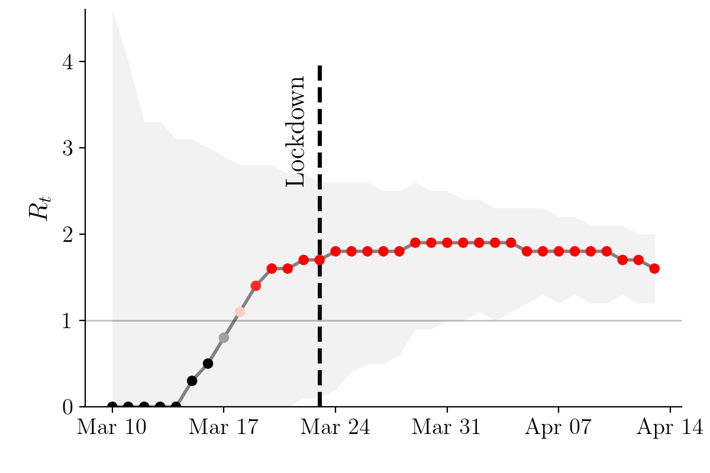
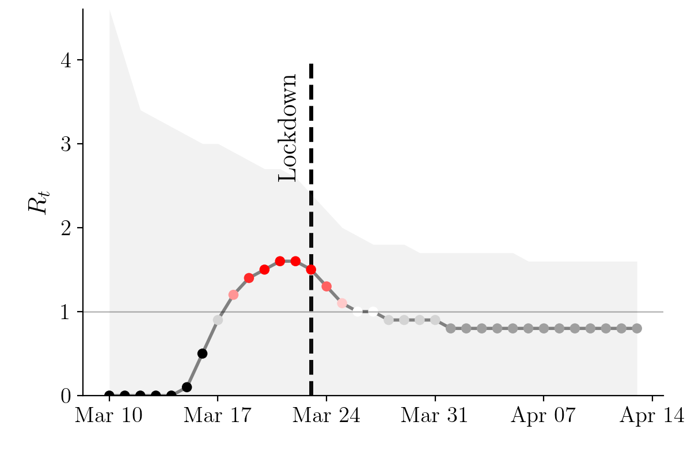

# A Spatiotemporal Epidemic Model to Quantify The Effects of Testing, Contact Tracing and Containment

This repository contains scripts and notebooks to run the sampling algorithm of a high resolution spatiotemporal epidemic model, which can be used to predict the spread of COVID-19 under different testing & tracing strategies, social distancing measures and business restrictions in an arbitrary city/town. Details about the relevant theory and methods can be found in the [paper](https://arxiv.org/abs/2004.07641).

## Project description

We introduce a modeling framework for studying epidemics that is specifically designed to make use of fine-grained spatiotemporal data. Motivated by the availability of data from contact tracing technologies and the current COVID-19 outbreak, our model uses marked temporal point processes to represent individual mobility patterns and the course of the disease for each individual in a population.

The sampling algorithm provided in this repository can be used to predict the spread of COVID-19 under different testing & tracing strategies, social distancing measures and business restrictions, given location or contact histories of individuals. Moreover, it gives a detailed representation of the disease's effect on each individual through time, distinguishing between several known states like asymptomatic, presymptomatic, symptomatic or recovered. 

<p align="center">

<em>Effective reproduction number with no measures taken.</em>
</p>

<p align="center">

<em>Effective reproduction number with measures.</em>
</p>

An inference script based on Bayesian Optimization allows to calibrate the exposure risk at various sites to match real case data over time and per age group.

The preliminary results generated using in this repository are focused on real COVID-19 data and mobility patterns from Tübingen, a town in the Southwest of Germany, but can be easily parameterized and used for generating realistic mobility patterns and simulating the spread of a disease for any given city/town. We are currently working on extending results for several towns and cities.

<p align="center">


</p>

## Version of arXiv pre-print results

As we are in the process of significantly refactoring the code base and extending the experiments, we did not update the notebook used to simulate the paper experiments, as it is now deprecated.
We release an up-to-date [example notebook](sim/exe-inference.ipynb) that shows how to use the code, simulation, and various measures

__If you would nevertheless like to play with the prior version or reproduce results currently shown in the arXiv pre-print, revert to commit__
`062f03bd809a5df3db7158e4075f855ce110dfcc`


## Dependencies

All the experiments were executed using Python 3. In order to create a virtual environment and install the project dependencies you can run the following commands:

```bash
python3 -m venv env
source env/bin/activate
pip install -r sim/requirements.txt
```

## Code organization

In the following tables, short descriptions of notebooks and main scripts are given. The notebooks are self-explanatory and execution details can be found within them.

| Notebook              | Description                                                   |
|-----------------------|---------------------------------------------------------------|
| [town-generator.ipynb](sim/town-generator.ipynb)  | Generates population, site and mobility data for a given town. |
| [sim-example.ipynb](sim/sim-example.ipynb)     | Example experiment on the spread of the disease under testing, contact tracing and/or containment measures. |

| Scripts              | Description                                                   |
|-----------------------|---------------------------------------------------------------|
| [calibrate.py](sim/calibrate.py)  | Calibrates the model based on real case data. Run `calibrate.py --help` for help. |


| Modules                | Description                                                   |
|-----------------------|---------------------------------------------------------------|
| [distributions.py](sim/lib/distributions.py) | Contains COVID-19 constants and distribution sampling functions. |
| [town_data.py](sim/lib/town_data.py)  | Contains functions for population and site generation. |
| [data.py](sim/lib/data.py)   | Contains functions for COVID-19 data collection. |
| [mobilitysim.py](sim/lib/mobilitysim.py) | Produces a **MobilitySimulator** object for generating mobility traces. |
| [dynamics.py](sim/lib/dynamics.py) | Produces a **DiseaseModel** object for simulating the spread of the disease. |
| [parallel.py](sim/lib/parallel.py) | Contains functions used for simulations on parallel threads. |
| [measures.py](sim/lib/measures.py) | Produces a **Measure** object for implementing intervention policies. |
| [inference.py](sim/lib/inference.py) | Contains functions used for Bayesian optimization. |
| [plot.py](sim/lib/plot.py) | Produces a **Plotter** object for generating plots. |
| [town_maps.py](sim/lib/plot.py) | Produces a **MapIllustrator** object for generating interactive maps. |


## Citation

If you use parts of the code in this repository for your own research purposes, please consider citing:

    @article{lorch2020spatiotemporal,
        title={A Spatiotemporal Epidemic Model to Quantify the Effects of Contact Tracing, Testing, and Containment},
        author={Lars Lorch and William Trouleau and Stratis Tsirtsis and Aron Szanto and Bernhard Sch\"{o}lkopf and Manuel Gomez-Rodriguez},
        journal={arXiv preprint arXiv:2004.07641},
        year={2020}
    }